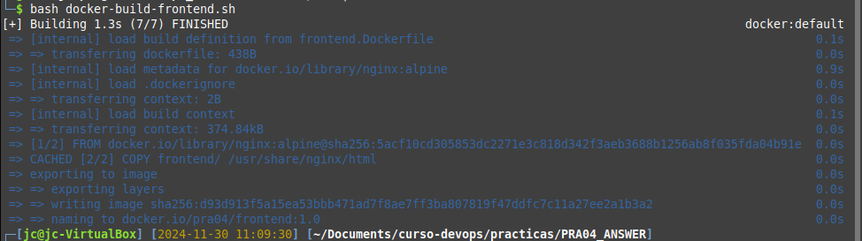
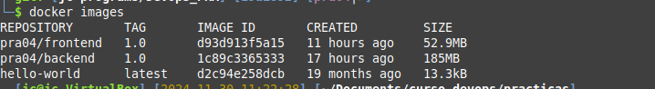
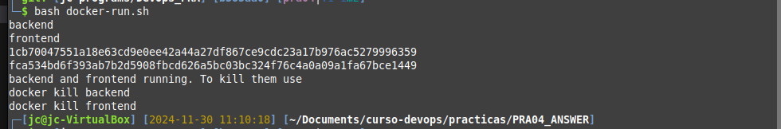
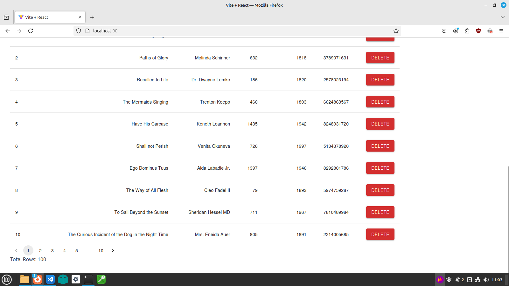
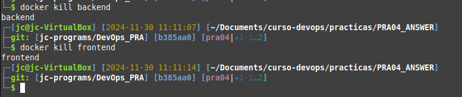

# PRA04

## Explanation

I created scripts to automate all the process using .env variables to:  
- prepare resources to create both dockers: `copy-resources-sh`
    - backend
    - frontend
- create backend docker: `docker-build-backend.sh`
    Replaced `openjdk:21-jdk-slim` by `bellsoft/liberica-openjdk-alpine:21` because is lighter and is the official recomendation from [spring.io](https://spring.io/quickstart)
- create frontend docker: `docker-build-frontend.sh`
- create `docker-run.sh` to execute both dockers

To load variables from .env file I created some util files:
- remove-comments.sed  
    remove all shell comments, after # char, but keeping strings. Code based on [this post](https://sleeplessbeastie.eu/2012/11/07/how-to-remove-comments-from-a-shell-script/)

    Example cleaning of comments and empty lines:
    ```
    bash util/clean-env-file.sh util/to-test.sh
    ```

    Example of loading env vars:
    ```
    bash util/test-load-env.sh
    ```

## Screenshots

### docker build backend


### docker build frontend


### list docker images


### launching dockers


### dockers working


### killing dockers



## Tasks

1. [x] Install Docker CLI
2. [x] Create a DockerHub Account
3. [x] Create Dockerfiles
4. [x] Build and Run Docker Containers
5. [ ] H2 Database Configuration
6. [ ] Implement Book API with Spring Boot
7. [x] Consume API with React using Axios

