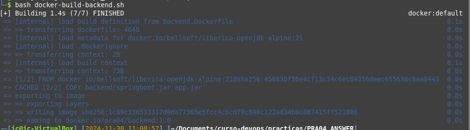

# PRA05

## Explanation


## Execution

Primero: descargar de hub.docker.com jenkins
```
# descargar de hub.docker.com jenkins
docker pull jenkins/jenkins
```


creado script `create-run-jenkins.sh`
```
#!/bin/bash

# name of Jenkins container
NAME=jenkins

# save current dir
DIR=$(pwd)

if [ $( docker ps -a -f name="${NAME}" 2> /dev/null | wc -l ) -eq 2 ]; then
    echo "${NAME} container already exists"
else
    # script dir is the location of this script
    SCRIPT_DIR=$( cd -- "$( dirname -- "${BASH_SOURCE[0]}" )" &> /dev/null && pwd )
    # jenkins home is in this same folder
    DIR_HOME="${SCRIPT_DIR}"/jenkins_home
    docker run -d -p 9090:8080 -p 50000:50000 \
        -v "${DIR_HOME}":/var/jenkins_home \
        -v /var/run/docker.sock:/var/run/docker.sock \
        --name "${NAME}" \
        jenkins/jenkins:latest
    echo "${NAME} created and running"
    echo "Jenkins home directory is: ${DIR_HOME}"
fi

if [ "$(docker inspect -f '{{.State.Status}}' "${NAME}" 2>/dev/null)" = "running" ]; then 
    echo "${NAME} container is already running"
else
    docker start "${NAME}"
    echo "${NAME} container started"
fi

# go to saved location
cd "${DIR}"
```


```
bash create-run-jenkins.sh

# obtener el password que hay que introducir con
docker exec jenkins cat /var/jenkins_home/secrets/initialAdminPassword
```

abrir el navegador en esta [ulr de login](http://localhost:9090/login) e introducir el password obtenido con la instrucción anterior.

Ya desde la [web de administración de Jenkins](http://localhost:9090/): 
- Instalar los plugins sugeridos
- Configurar el usuarios de administrado
- Tools
    - Maven 3.9.9, con autoinstalador
    - JDK's:
        Con autoinstalador desde url y en el directorio JDK**x**
        - [JDK 8](https://builds.openlogic.com/downloadJDK/openlogic-openjdk/8u432-b06/openlogic-openjdk-8u432-b06-linux-x64.tar.gz)
        - [JDK 11](https://builds.openlogic.com/downloadJDK/openlogic-openjdk/11.0.25+9/openlogic-openjdk-11.0.25+9-linux-x64.tar.gz)
        - [JDK 17](https://builds.openlogic.com/downloadJDK/openlogic-openjdk/17.0.13+11/openlogic-openjdk-17.0.13+11-linux-x64.tar.gz)
        - [JDK 21](https://builds.openlogic.com/downloadJDK/openlogic-openjdk/21.0.5+11/openlogic-openjdk-21.0.5+11-linux-x64.tar.gz)


Probada app Vaadin para hacer las pruebas de pipeline
su [github](https://github.com/jc-programs/SpringConference.git). Se utilizará la branch `docker-version`
```
mvn clean install -Pproduction
java -jar target/springConference-0.0.1-SNAPSHOT.jar
# abrir el navegador en http://localhost:8080
```

groovy
```
pipeline {
    agent any
    stages {
        stage ('Checking java version') {
            steps {
                sh "java -version"
            }
        }
        stage ('Checking maven version') {
            steps {               
                sh "mvn -version"
            }
        }
        stage('Checkout git') {
            steps {
                // set repository url and branch
                git branch: 'docker-version', url: 'https://github.com/jc-programs/SpringConference.git'
            }
        }
        stage ('build app skiping test') {
            steps {               
                sh 'mvn clean install -DskipTests=true -Pproduction'
            }
        }
        // stage ('docker image build')
        // {
        //     steps {
        //         sh 'mvn dockerfile:build'
        //     }
        //   }
        // stage ('docker image push to Docker Hub') {
        //     steps {               
        //             sh 'mvn dockerfile:push'                          
        //     }
        // }
    }
}
```


## Screenshots

### docker build backend



## Tasks

1. [x] Pull Jenkins Docker Image
2. [x] Build and Run Jenkins Container
3. [x] Configure Jenkins Account
4. [ ] Install Basic Plugins
    - [x] Maven Integration
    - [x] Git
    - [x] Docker
    - [x] SSH
    - [ ] SonarQube Scanner
5. [ ] Create a Pipeline for Spring Boot Project