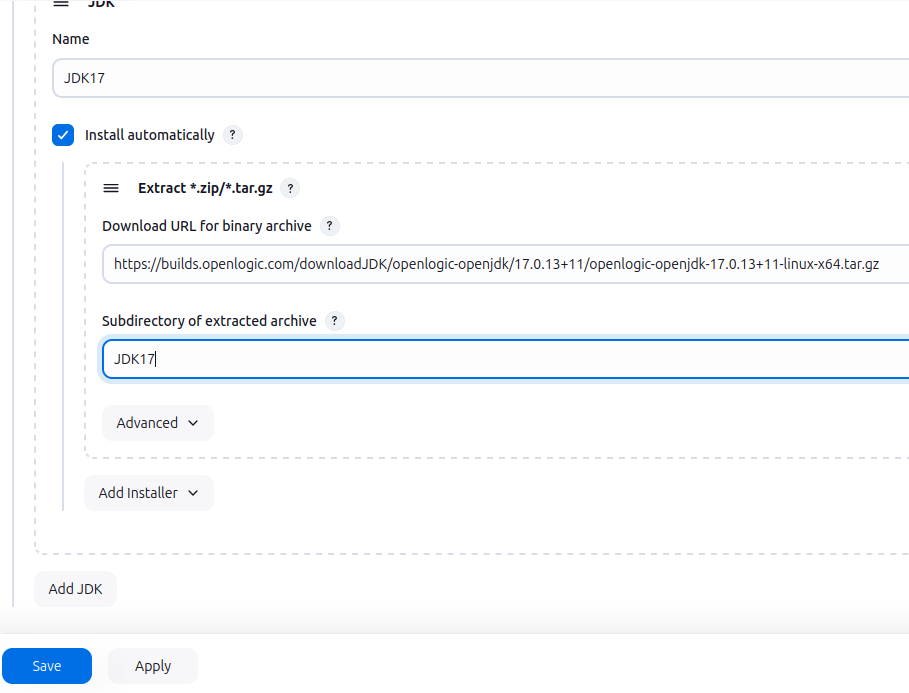

# PRA05

## Tasks

1. [x] Pull Jenkins Docker Image
2. [x] Build and Run Jenkins Container
3. [x] Configure Jenkins Account
4. [x] Install Basic Plugins
    - [x] Maven Integration
    - [x] Git
    - [x] Docker
    - [x] SSH
    - [x] SonarQube Scanner
5. [x] Create a Pipeline for Spring Boot Project
6. [x] Bonus: Export & import container

## Execution

Primero: descargar de hub.docker.com jenkins
```
# descargar de hub.docker.com jenkins
docker pull jenkins/jenkins
```


creado script `create-run-jenkins.sh`
```
#!/bin/bash

# name of Jenkins container
NAME=jenkins

# save current dir
DIR=$(pwd)

if [ $( docker ps -a -f name="${NAME}" 2> /dev/null | wc -l ) -eq 2 ]; then
    echo "${NAME} container already exists"
else
    # script dir is the location of this script
    SCRIPT_DIR=$( cd -- "$( dirname -- "${BASH_SOURCE[0]}" )" &> /dev/null && pwd )
    # jenkins home is in this same folder
    DIR_HOME="${SCRIPT_DIR}"/jenkins_home
    docker run -d -p 9090:8080 -p 50000:50000 \
        -v "${DIR_HOME}":/var/jenkins_home \
        -v /var/run/docker.sock:/var/run/docker.sock \
        --privileged \
        --name "${NAME}" \
        jenkins/jenkins:latest
    echo "${NAME} created and running"
    echo "Jenkins home directory is: ${DIR_HOME}"
fi

if [ "$(docker inspect -f '{{.State.Status}}' "${NAME}" 2>/dev/null)" = "running" ]; then 
    echo "${NAME} container is already running"
else
    docker start "${NAME}"
    echo "${NAME} container started"
fi

# go to saved location
cd "${DIR}"
```


```
bash create-run-jenkins.sh

# obtener el password que hay que introducir con
docker exec jenkins cat /var/jenkins_home/secrets/initialAdminPassword
```

abrir el navegador en esta [ulr de login](http://localhost:9090/login) e introducir el password obtenido con la instrucción anterior.

Ya desde la [web de administración de Jenkins](http://localhost:9090/): 
- Instalar los plugins sugeridos
- Configurar el usuarios de administrado
- Tools
    - Maven 3.9.9, con autoinstalador
    - JDK's:
        Con autoinstalador desde url y en el directorio JDK**x**
        - [JDK8](https://github.com/AdoptOpenJDK/openjdk8-binaries/releases/tag/jdk8u292-b10) en el directorio `jdk8u292-b10`
        - [JDK11](https://download.java.net/java/GA/jdk11/9/GPL/openjdk-11.0.2_linux-x64_bin.tar.gz) en el directorio `jdk-11.0.2`
        - [JDK17](https://download.java.net/java/GA/jdk17.0.2/dfd4a8d0985749f896bed50d7138ee7f/8/GPL/openjdk-17.0.2_linux-x64_bin.tar.gz) en el directorio `jdk-17.0.2`
        - [JDK21](https://download.java.net/java/GA/jdk21.0.2/f2283984656d49d69e91c558476027ac/13/GPL/openjdk-21.0.2_linux-x64_bin.tar.gz) en el directorio `jdk-21.0.2`


Probada app Vaadin para hacer las pruebas de pipeline
su [github](https://github.com/jc-programs/SpringConference.git). Se utilizará la branch `docker-version`
```
mvn clean install -Pproduction
java -jar target/springConference-0.0.1-SNAPSHOT.jar
# abrir el navegador en http://localhost:8080
```

groovy con mi pipeline
```
pipeline {
    agent any

    environment {
        // DOCKERHUB_CREDENTIALS = credentials('dockerhub_id')
        IMAGE_NAME = 'jcprograms/springconference'
        IMAGE_TAG = "${BUILD_NUMBER}"
    }

    tools {
        maven "MAVEN3"
        jdk 'JDK17'
    }

    stages {
        stage ('Checking java version') {
            steps {
                sh 'java --version'
            }
        }
        
        stage ('Checking maven version') {
            steps {               
                sh 'mvn --version'
            }
        }
        
        stage ('Checking docker version') {
            steps {               
                sh 'docker --version'
            }
        }
        
        
        stage('Checkout git') {
            steps {
                // set repository url and branch
                git branch: 'docker-version', url: 'https://github.com/jc-programs/SpringConference.git'
            }
        }

        stage ('build app skiping test') {
            steps {               
                sh 'mvn clean package -DskipTests=true -Pproduction'
            }
        }

        stage('Archive .jar') {
            steps {
                archiveArtifacts artifacts: '**/target/*.jar', fingerprint: true
            }
        }
        
        stage('Build Docker Image') {
            steps {
                script {
                    docker.build("${IMAGE_NAME}:${IMAGE_TAG}")
                }
            }
        }
 
 
        stage('Login to Docker Hub') {
            steps {
                script {
                    docker.withRegistry('', 'dockerhub_id') {
                        // This block will log in using the credentials specified
                        sh 'echo loged in docker'
                    }
                }
            }
        }

        stage('Push Image to Docker Hub') {
            steps {
                script {
                    docker.withRegistry('', 'dockerhub_id') {
                        docker.image("${IMAGE_NAME}:${IMAGE_TAG}").push()
                        docker.image("${IMAGE_NAME}:${IMAGE_TAG}").push('latest')
                    }
                }
            }
        }
    }
 
    post {
        always {
            sh "docker rmi ${IMAGE_NAME}:${IMAGE_TAG}"
            sh "docker rmi ${IMAGE_NAME}:latest"
        }
    }
}```

## Creando la imagen docker con el compilado

Añado en el directorio raíz del proyecto java el fichero `Dockerfile`

```{Dockerfile}
FROM bellsoft/liberica-openjdk-alpine:17
ARG JAR_FILE=target/*.jar
COPY ${JAR_FILE} app.jar
EXPOSE 8080
ENTRYPOINT ["java","-jar","/app.jar"]
```

## instalación de docker en el container de jenkins

con el container de jenkins ejecutándose conectarse a su `bash` como root
```
docker exec -it -u root jenkins bash
```

y dentro de instalar docker con
```
apt install docker.io
```
y comprobar que los permisos del socket de docker son los correctos
```
ls -la /var/run/docker.sock
```
debe devolver
```
srw-rw---- 1 root jenkins 0 Dec 10 07:41 /var/run/docker.sock
```
si el socket no tiene estos permisos cambiarlos con:
```
chown root:jenkins /var/run/docker.sock
chmod 660 /var/run/docker.sock
```


## Extra: export & import docker container

Siguiendo las instrucciones de este [artículo](https://www.maketecheasier.com/copy-move-docker-container-to-another-host/) he conseguido exportar e importar el contenido de un contenedor docker.

### Paso 0: instalar `docker-volumes.sh`

[github de `docker-volumes.sh`](https://github.com/ricardobranco777/docker-volumes.sh)


https://raw.githubusercontent.com/ricardobranco777/docker-volumes.sh/master/docker-volumes.sh

```
curl -o docker-volumes.sh https://raw.githubusercontent.com/ricardobranco777/docker-volumes.sh/master/docker-volumes.sh
chmod +x docker-volumes.sh
sudo mv docker-volumes.sh /usr/local/bin/

```

### Paso 1: exportar docker contaniner

mi container se llama `jenkins`
docker image se llamará `jenkins-image` y se guardará en `jenkins.tar`
el volumen (jenkins_home) se guarda en el fichero `jenkins-volume.tar`

```
# parar el container
docker stop jenkins

# guardar imagen del container en jenkins-image
docker commit jenkins jenkins-image

# guardar los datos de la imagen en fichero .tar
docker save -o jenkins.tar jenkins-image

# guardar el volumen del contenedor
docker-volumes.sh jenkins save jenkins-volume.tar
```


### Paso 2. Importar la imagen sin importar el volumen

Log in to your remote host, then run the following command to load it to your remote machine’s Docker daemon:

```
docker load -i ./jenkins.tar
```

se crea la imagen `jenkins-image`
pero la vamos a renombrar a `pra05/jenkins-image`

```
docker image tag jenkins-image:latest pra05/jenkins-image:latest
docker rmi jenkins-image
```


Use docker create to reinitialize your Docker container image with its original run flags from your source machine. For instance, my Nginx Docker container originally had port 80 mapped to my host machine’s port 8080:

```
docker create --name jenkins-home -p 9090:8080 -p 50000:50000 pra05/jenkins-image
```

Run your newly imported Docker container:

```
docker start jenkins-home
```

Confirm that your imported image is working properly by listing all the active containers in the system:

```
docker ps
```


#### Paso 3. Importar la imagen importando el volumen
Create a new Docker container using your exported image file:

```
docker create --name jenkins-home \ 
    -v jenkins_home:/var/jenkins_home \
    -p 9090:8080 -p 50000:50000 pra05/jenkins-image
```

Run the docker-volume.sh script with your original .tar file to load it to your new system’s Docker daemon:

```
docker-volumes.sh jenkins-home load jenkins-volume.tar
```

Start your new Docker container by running the following command:

```
docker start jenkins-home
```

Test if your container is loading your volume properly by looking at its internal config data:

```
docker inspect -f '{{ .Mounts }}' jenkins-home
```


## Screenshots

### configuración maven3
01. 
### configuración jdk8
02. 
### configuración jdk11
03. 
### configuración jdk17
04. 
### configuración jdk21
05. 
### configuración maven-integration
06. 
### configuración docker-plugins
07. 
### configuración ssh-plugins
08. 
### configuración sonnar-qube-plugin
09. 
### pipeline sin docker
10. 
### pipeline con docker y dockerhub
11. 
### pipeline con docker y dockerhub
12. 
### probando la imagen de docker: login y pull
13. 
### probando la imagen de docker: running
14. 
### probando la imagen de docker: funciona!
15. 
