# PRA06

TODO DELETE
rsync -ar ~/Pictures/aws/./* ~/Documents/devops/prácticas/DevOps_PRA/PRA06_ANSWER/_PRA/img/pra06/
rsync -ar ~/Pictures/aws/./* ~/Documents/curso-devops/DevOps_PRA/PRA06_ANSWER/_PRA/img/pra06/
https://docs.aws.amazon.com/AmazonECS/latest/developerguide/getting-started-fargate.html


## Tasks

1. [x] Create an AWS Account
    1. [x] Visit the AWS website and click "Create an AWS Account"
    2. [x] Follow the registration process, providing necessary information
    3. [x] Choose a support plan (Basic is free and sufficient for this exercise)
2. [ ] Set Up AWS Budget and Billing Alerts
    1. [x] Navigate to AWS Budgets in the AWS Management Console
    2. [x] Click "Create budget" and choose "Customize (advanced)"
    3. [x] Select "Cost budget" and set a monthly fixed budget
    4. [x] Configure alerts for 80% of your budgeted amount
    5. [ ] Set up an action to automatically apply an IAM policy restricting resource creation when the budget is exceeded
3. [ ] Create AWS Services for Spring Boot Docker Deployment
    1. [x] Set up Amazon Elastic Container Registry (ECR)
    2. [1/2] Configure Amazon Elastic Container Service (ECS)
    3. [ ] Set up AWS Fargate
4. [ ] Update Jenkins Pipeline for AWS Deployment
5. [ ] Deploy Spring Boot Application


## Execution

login to aws
```
aws ecr get-login-password --region eu-central-1 | docker login --username AWS --password-stdin 183631312119.dkr.ecr.eu-central-1.amazonaws.com/jcprograms/spring-conference
```

pull del docker de github y luego subirlo a ECR
```
docker pull jcprograms/springconference 
docker tag jcprograms/springconference 183631312119.dkr.ecr.eu-central-1.amazonaws.com/jcprograms/spring-conference
docker push 183631312119.dkr.ecr.eu-central-1.amazonaws.com/jcprograms/spring-conference
```

## Data

docker pull jcprograms/springconference 
docker tag jcprograms/springconference 183631312119.dkr.ecr.eu-central-1.amazonaws.com/jcprograms/spring-conference
docker push 183631312119.dkr.ecr.eu-central-1.amazonaws.com/jcprograms/spring-conference


dockerhub: docker imate
jcprograms/springconference

ECR: private image
183631312119.dkr.ecr.eu-central-1.amazonaws.com/jcprograms/spring-conference

ECS: Cluster
springConferenceClusterV2
arn:aws:ecs:eu-central-1:183631312119:cluster/springConferenceClusterV2

    SpringConferenceContainer

    

Fargate:


## Screenshots

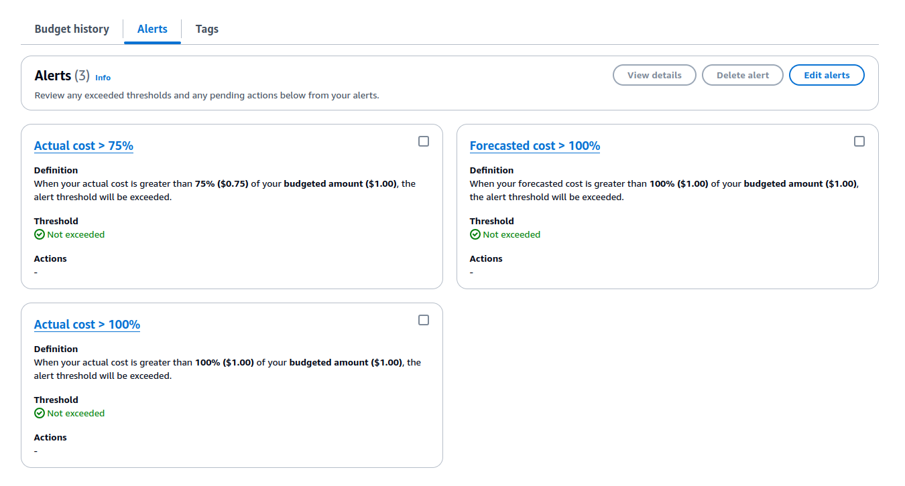
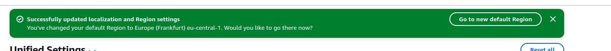

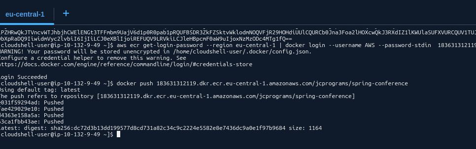


### configuración maven3
01. 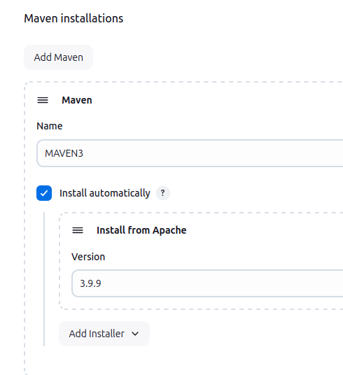
### configuración jdk8
02. 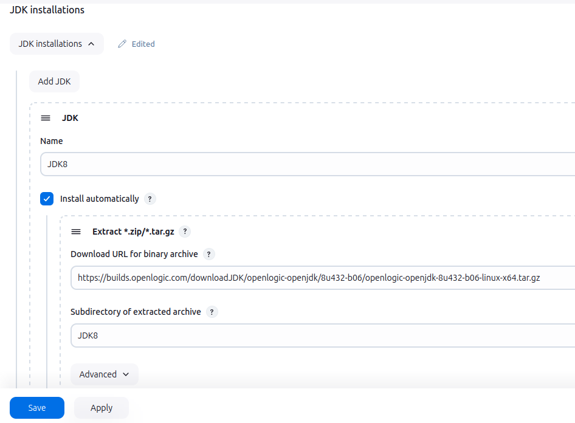
### configuración jdk11
03. 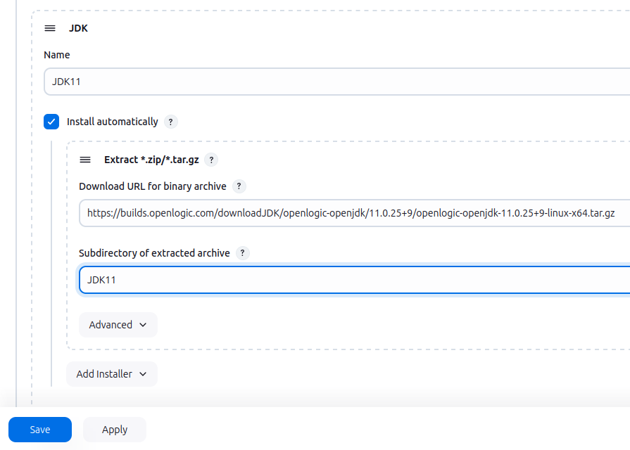
### configuración jdk17
04. 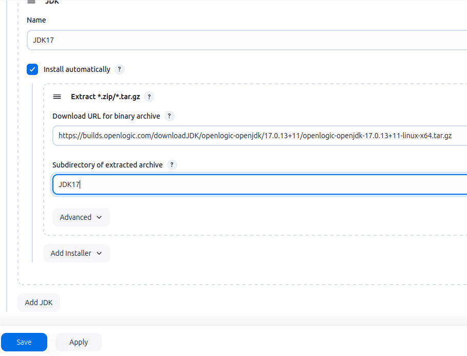
### configuración jdk21
05. 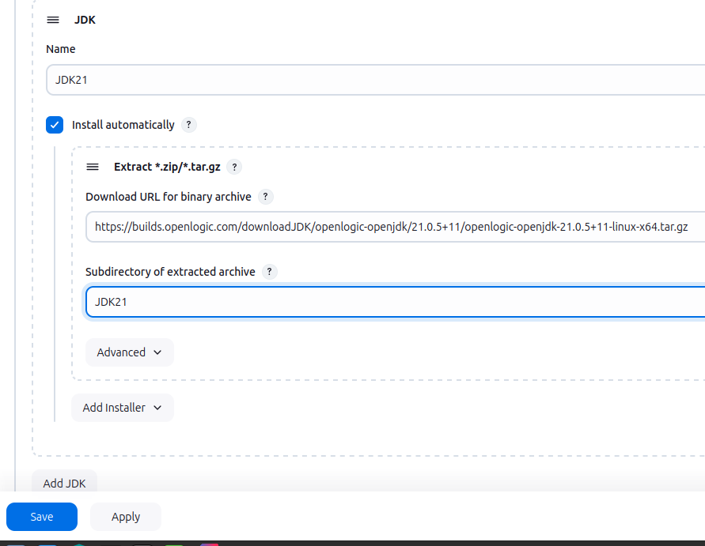
### configuración maven-integration
06. 
### configuración docker-plugins
07. 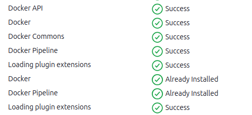
### configuración ssh-plugins
08. 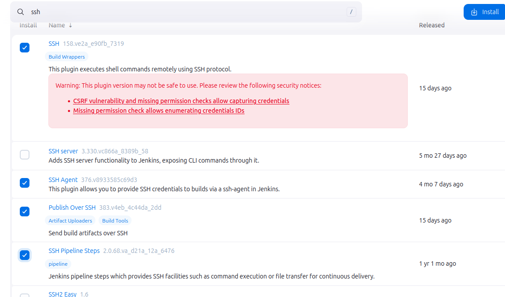
### configuración sonnar-qube-plugin
09. 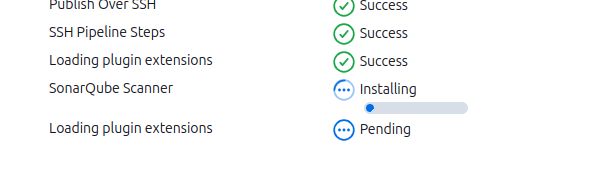
### pipeline sin docker
10. 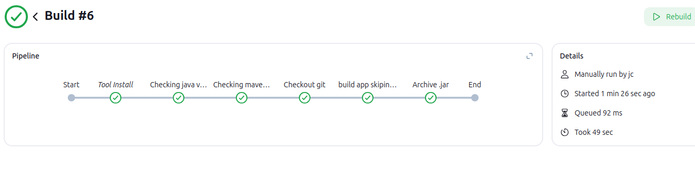
### pipeline con docker y dockerhub
11. 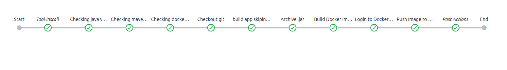
### pipeline con docker y dockerhub
12. 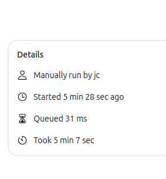
### probando la imagen de docker: login y pull
13. 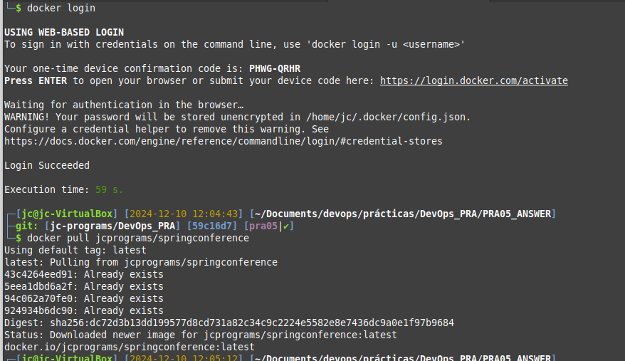
### probando la imagen de docker: running
14. 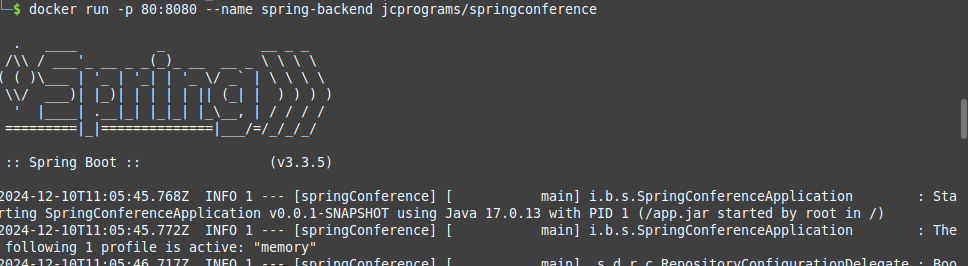
### probando la imagen de docker: funciona!
15. 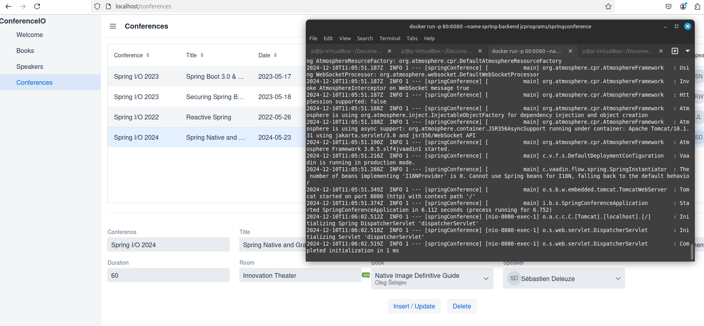
