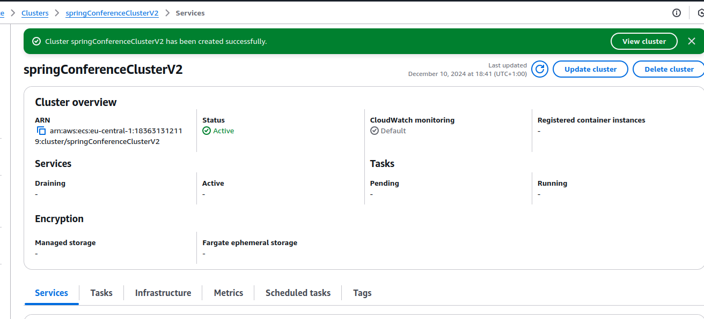

# PRA06

Mi imagen docker de SpringConference deployada a AWS: [http://3.66.219.45:8080/](http://3.66.219.45:8080/)

## Tasks

1. [x] Create an AWS Account
    1. [x] Visit the AWS website and click "Create an AWS Account"
    2. [x] Follow the registration process, providing necessary information
    3. [x] Choose a support plan (Basic is free and sufficient for this exercise)
2. [4/5] Set Up AWS Budget and Billing Alerts
    1. [x] Navigate to AWS Budgets in the AWS Management Console
    2. [x] Click "Create budget" and choose "Customize (advanced)"
    3. [x] Select "Cost budget" and set a monthly fixed budget
    4. [x] Configure alerts for 80% of your budgeted amount
    5. [ ] Set up an action to automatically apply an IAM policy restricting resource creation when the budget is exceeded
3. [x] Create AWS Services for Spring Boot Docker Deployment
    1. [x] Set up Amazon Elastic Container Registry (ECR)
    2. [x] Configure Amazon Elastic Container Service (ECS)
    3. [x] Set up AWS Fargate
4. [ ] Update Jenkins Pipeline for AWS Deployment
5. [x] Deploy Spring Boot Application


## Execution

login to aws
```
aws ecr get-login-password --region eu-central-1 | docker login --username AWS --password-stdin 183631312119.dkr.ecr.eu-central-1.amazonaws.com/jcprograms/spring-conference
```

pull del docker de github y luego subirlo a ECR
```
docker pull jcprograms/springconference 
docker tag jcprograms/springconference 183631312119.dkr.ecr.eu-central-1.amazonaws.com/jcprograms/spring-conference
docker push 183631312119.dkr.ecr.eu-central-1.amazonaws.com/jcprograms/spring-conference
```

Mi pipeline de `Jenkins` que crea el docker y hace pull a docker hub
```
pipeline {
    agent any

    environment {
        IMAGE_NAME = 'jcprograms/springconference'
        IMAGE_TAG = "${BUILD_NUMBER}"
    }

    tools {
        maven "MAVEN3"
        jdk 'JDK17'
    }

    stages {
        stage ('Checking java version') {
            steps {
                sh 'java --version'
            }
        }
        
        stage ('Checking maven version') {
            steps {               
                sh 'mvn --version'
            }
        }
        
        stage ('Checking docker version') {
            steps {               
                sh 'docker --version'
            }
        }
        
        
        stage('Checkout git') {
            steps {
                // set repository url and branch
                git branch: 'docker-version', url: 'https://github.com/jc-programs/SpringConference.git'
            }
        }

        stage ('build app skiping test') {
            steps {               
                sh 'mvn clean package -DskipTests=true -Pproduction'
            }
        }

        stage('Archive .jar') {
            steps {
                archiveArtifacts artifacts: '**/target/*.jar', fingerprint: true
            }
        }
        
        stage('Build Docker Image') {
            steps {
                script {
                    docker.build("${IMAGE_NAME}:${IMAGE_TAG}")
                }
            }
        }
 
 
        stage('Login to Docker Hub') {
            steps {
                script {
                    docker.withRegistry('', 'dockerhub_id') {
                        // This block will log in using the credentials specified
                        sh 'echo loged in docker'
                    }
                }
            }
        }

        stage('Push Image to Docker Hub') {
            steps {
                script {
                    docker.withRegistry('', 'dockerhub_id') {
                        docker.image("${IMAGE_NAME}:${IMAGE_TAG}").push()
                        docker.image("${IMAGE_NAME}:${IMAGE_TAG}").push('latest')
                    }
                }
            }
        }
    }
 
    post {
        always {
            sh "docker rmi ${IMAGE_NAME}:${IMAGE_TAG}"
            sh "docker rmi ${IMAGE_NAME}:latest"
        }
    }
}
```

## Screenshots

### Alertas
01. 
### Asignar región por defecto
02. 
### Download mi docker a ECR
03. 
### Push de mi docker a ECR
04. 
### Docker en ECR
05. 
### Inicio de ECS
06. 
### Definición de task 1
07. 
### Definición de task 2
08. 
### Definición de task 3
09. 
### Task creada
10. 
### Task deployment definición 1
11. 
### Task deployment definición 2
12. 
### Task deployment 1
13. 
### Task deployment 2
14. 
### Network configuration
15. 
### Network configuration
16. 
### Fargate is working
17. 
