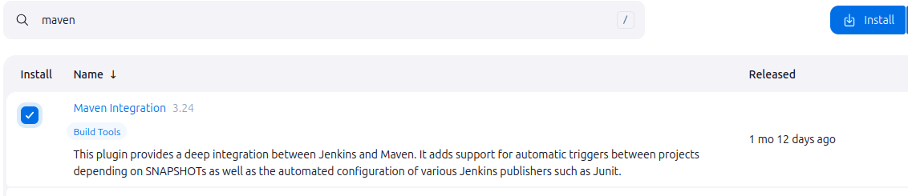

# PRA06

## Tasks

1. [ ] Create an AWS Account
2. [ ] Set Up AWS Budget and Billing Alerts
3. [ ] Create AWS Services for Spring Boot Docker Deployment
4. [ ] Update Jenkins Pipeline for AWS Deployment
5. [ ] Deploy Spring Boot Application

## Execution

## Screenshots

### configuración maven3
01. 
### configuración jdk8
02. 
### configuración jdk11
03. 
### configuración jdk17
04. 
### configuración jdk21
05. 
### configuración maven-integration
06. 
### configuración docker-plugins
07. 
### configuración ssh-plugins
08. 
### configuración sonnar-qube-plugin
09. 
### pipeline sin docker
10. 
### pipeline con docker y dockerhub
11. 
### pipeline con docker y dockerhub
12. 
### probando la imagen de docker: login y pull
13. 
### probando la imagen de docker: running
14. 
### probando la imagen de docker: funciona!
15. 
