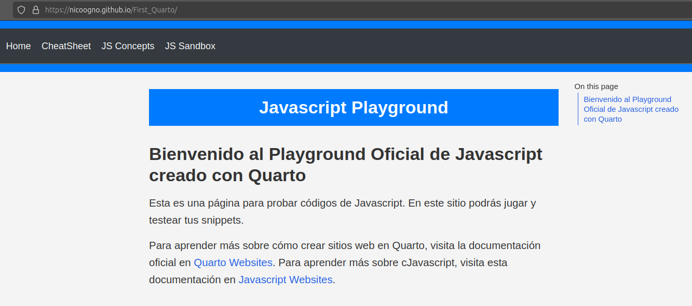
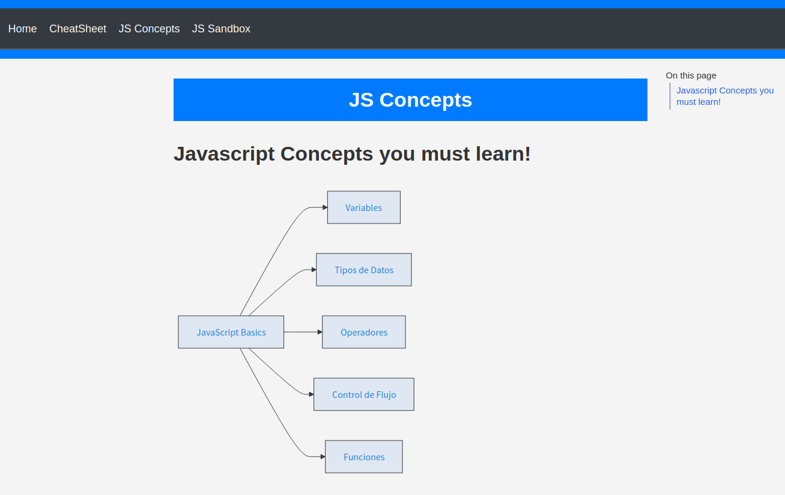

# MF01-PRA01

## Creación local de Quarto

La página posee callouts para destacar información importante, un layout genérico, un formato genérico dependiendo si es título, body o header y distintas páginas.

Se puede navegar entre las páginas con la configuración de Quarto.

La página *JS Concepts* tiene gráficos *Mermaid*.

El archivo _quarto.yml está configurado.

Se creó repositorio GIT linkeado a repositorio GIT remoto.

Se publicó el sitio web en GitHub Pages: `https://nicoogno.github.io/First_Quarto/js_map.html`

