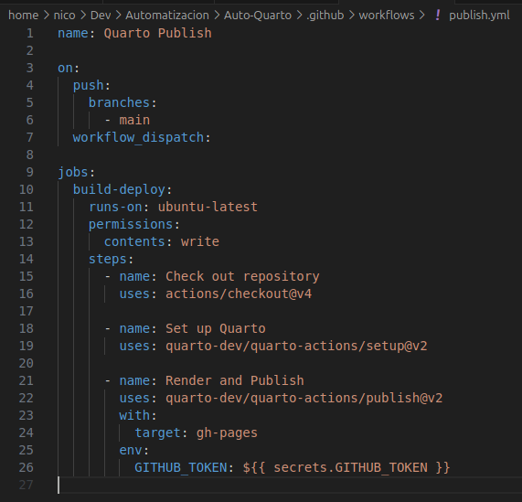

# MF02-PRA02

## Automatización Publish de Quarto

- Automatización exitosa del proceso de commit y push utilizando GitHub Actions.

- Configuración correcta del archivo publish.yml.

- Ejecución adecuada del flujo de trabajo de renderización y publicación del sitio Quarto.

- Claridad del código y calidad de la documentación.

- Cumplimiento de las mejores prácticas para GitHub Actions y Quarto.

- Esta acción se activará por cada `push` a la rama `main` o al despachar manualmente el `workflow`.