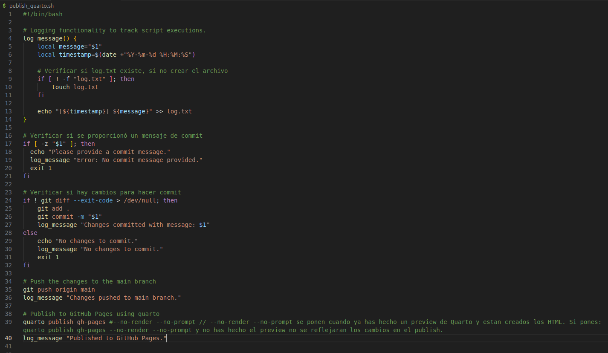

# Automatización local y remota de Quarto con Bash

## Objetivos

- Crear un script bash para automatizar las operaciones locales de git y la publicación de Quarto.
- Implementar funcionalidad de registro para rastrear las ejecuciones del script.
- Asegurarse de que el script sea flexible y fácil de usar.

## .github

Dentro del directorio *.github/workflows* se encuentra el archivo *publish.yml*

El directorio *.github* se debe agregar al directorio *Root* del proyecto *Quarto* y se pushea a Github. Luego los Push a Github siguientes harán de forma automática el *publish* del sitio Quarto

En el archivo publish.yml hay una configuración que dice:
 `env:
    GITHUB_TOKEN: ${{ secrets.GITHUB_TOKEN }}`

Lo que ocurre ahí es que Github Pages se comunica internamente con Github y obtiene el password de la cuenta de Github.

## publish_quarto.sh

- Este es un script Bash y hace lo siguiente:

    - git add .
    - git commit -am "mensaje puesto al lado del script al ejecutarlo"
    - git push
    - quarto publish gh-pages

Y también crea un archivo log.txt donde registra lo que ocurre.

**_NOTE:_** Crear archivo ejecutable `_publish.yml`(**hacerlo solo una vez cuando está recién creado, ya que Github Actions necesita ese archivo de configuración**):

Ejecutar el siguiente comando para crear el `script` ejecutable:

`chmod +x publish_quarto.sh`

## Usar el `Script`

Para usar el `script` se debe ejecutar con un mensaje de `commit` como argumento:

./publish_quarto.sh "Your commit message here"

- OJO: no se deben subir al repositorio remoto de github los archivos *publish_quarto.sh* ni *log.txt*

## Resultados

- Automatización exitosa del proceso de commit y push utilizando GitHub Actions.
- Configuración correcta del archivo publish.yml.
- Ejecución adecuada del flujo de trabajo de renderización y publicación del sitio Quarto.
- Claridad del código y calidad de la documentación.
- Cumplimiento de las mejores prácticas para GitHub Actions y Quarto.