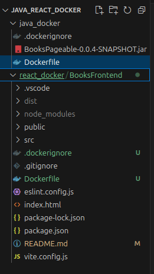
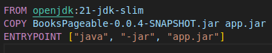
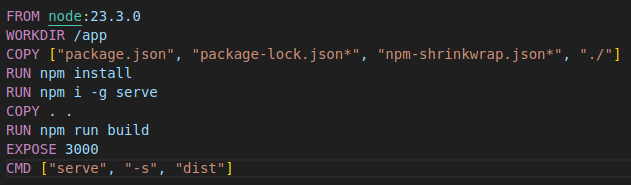

# Docker Setup y contenerización para Spring Boot y React

## Objetivos

- Instalar Docker CLI
- Crear una cuenta en DockerHub
- Crear archivos Dockerfile para aplicaciones Spring Boot y React
- Construir y ejecutar contenedores Docker
- Implementar una API de libros con Spring Boot
- Consumir la API con React utilizando Axios

## Estructura App

## Dockerfile de Java

`FROM openjdk:21-jdk-slim`
- Usamos la imagen base oficial de `OpenJDK 21` en su versión slim, que es una versión reducida para aplicaciones que requieren el `JDK` (`Java Development Kit`) para compilar y ejecutar.

 

`COPY BooksPageable-0.0.4-SNAPSHOT.jar app.jar`
- Copiamos el archivo `JAR` generado de la aplicación (`BooksPageable-0.0.4-SNAPSHOT.jar`) desde el contexto de construcción hacia el contenedor, renombrándolo como `app.jar`

 

`ENTRYPOINT ["java", "-jar", "app.jar"]`
- Definimos el punto de entrada para el contenedor, especificando que se ejecute el archivo `JAR` utilizando el comando `java -jar` para iniciar la aplicación Java.

**Resumen**: Este `Dockerfile` configura un contenedor que ejecutará una aplicación `Java` empaquetada como un archivo `JAR`. Se parte de una imagen base de `OpenJDK 21` y se copia el archivo `JAR` dentro del contenedor para luego ejecutarlo con el comando `java -jar`.

## Dockerfile React

`FROM node:23.3.0`
- Usamos la imagen base oficial de `Node.js versión 23.3.0`, que incluye `Node.js` y `npm`, para crear un entorno de ejecución adecuado para la aplicación.

 

`WORKDIR /app`
- Establecemos el directorio de trabajo en el contenedor como `/app`. Esto asegura que las operaciones posteriores se realicen dentro de este directorio.

 

`COPY ["package.json", "package-lock.json*", "npm-shrinkwrap.json*", "./"]`
- Copiamos los archivos `package.json`, `package-lock.json` (si existe) y `npm-shrinkwrap.json` (si existe) desde el directorio actual en el sistema local al contenedor. Esto se hace para poder instalar las dependencias correctamente.

 

`RUN npm install`
- Instalamos las dependencias del proyecto definidas en el archivo `package.json`.

 

`RUN npm i -g serve`
- Instalamos globalmente el paquete `serve`, que es una herramienta ligera para servir aplicaciones estáticas.

 

`COPY . .`
- Copiamos todos los archivos del directorio actual al contenedor, incluyendo el código fuente de la aplicación.

 

`RUN npm run build`
- Ejecutamos el script `npm run build`, que normalmente se utiliza para construir la versión optimizada de la aplicación (por ejemplo, minificando y optimizando los recursos).

 

`EXPOSE 3000`
- Exponemos el puerto `3000` en el contenedor, el cual será utilizado por la aplicación para recibir tráfico `HTTP`.

 

`CMD ["serve", "-s", "dist"]`
- Establecemos el comando que se ejecutará cuando se inicie el contenedor. Aquí, usamos el paquete `serve` para servir la aplicación desde el directorio `dist` (el directorio de salida de la compilación).

**Resumen**: Este `Dockerfile` crea una imagen de contenedor para una aplicación `Node.js`. Instala las dependencias necesarias, construye la aplicación (usando `npm run build`), y luego sirve los archivos estáticos generados con la herramienta `serve` en el puerto `3000`. El contenedor está diseñado para ejecutar una versión optimizada de la aplicación en un entorno de producción.

## Resultados

- Instalación exitosa de Docker CLI y creación de cuenta en DockerHub.
- Implementación correcta de los Dockerfiles tanto para Spring Boot como para React.
- Configuración adecuada de la base de datos H2.
- Cumplimiento de las mejores prácticas de Docker.
- Documentación clara y mensajes de commit detallados.