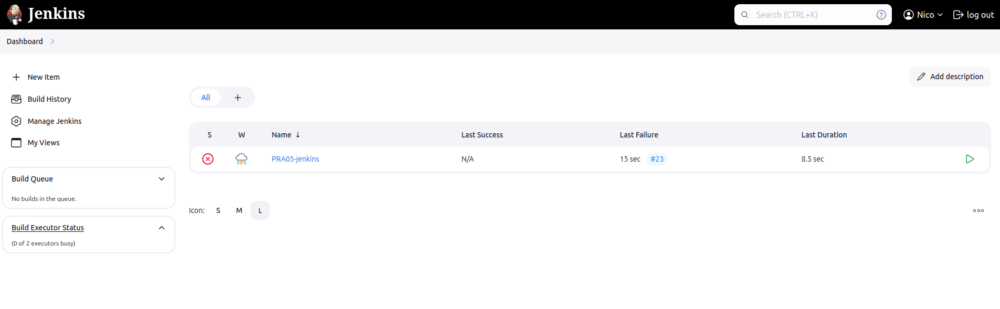
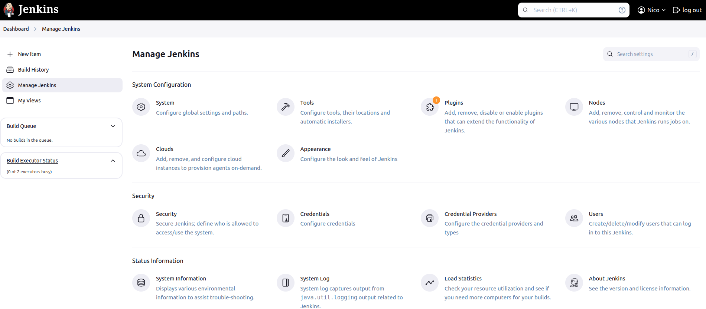
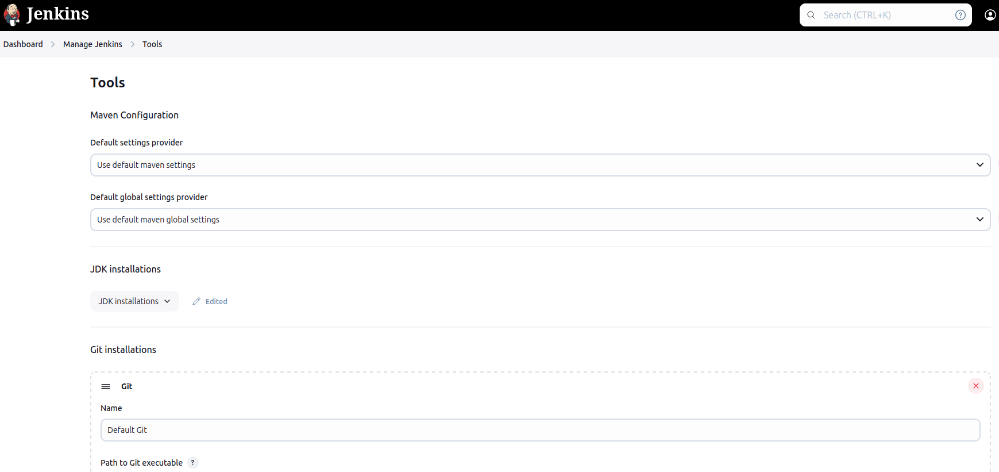
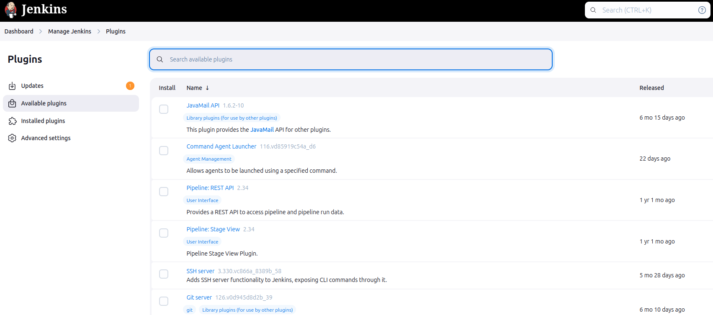
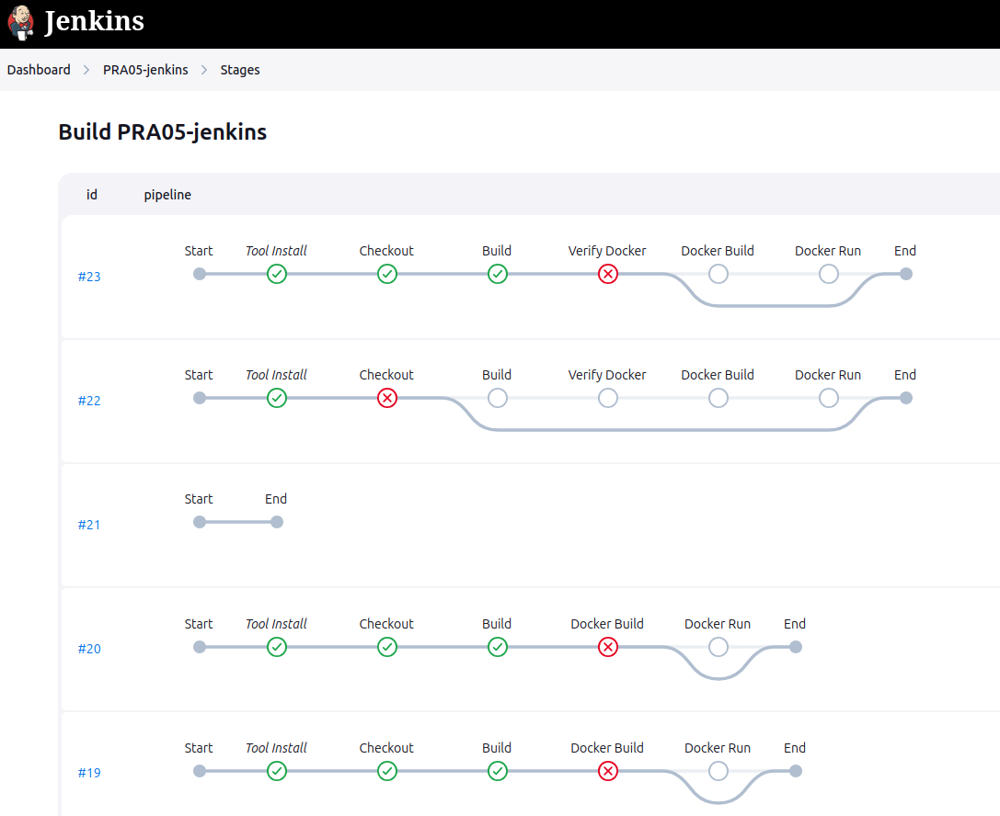
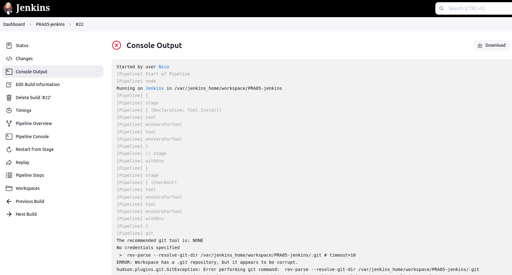
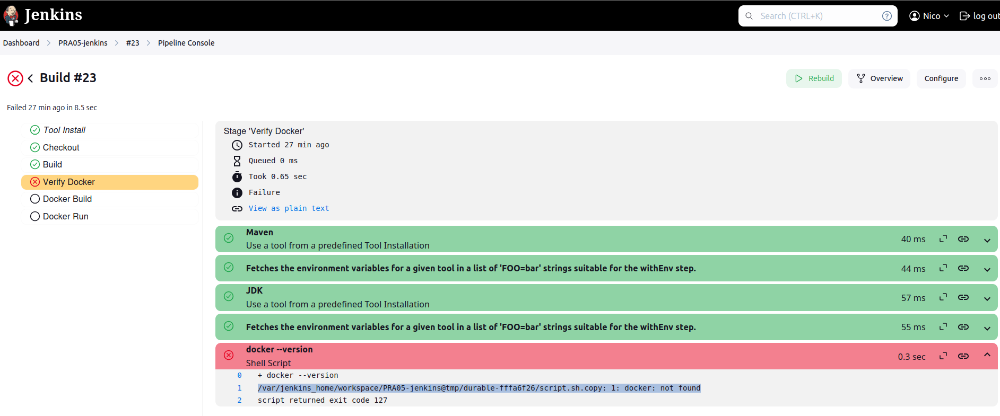

# Profundizar Jenkins

## En esta práctica se profundizó Jenkins

- Hacer correr Jenkins desde un Docker
- Crear usuario Jenkins
- Ejecutar un Git repo desde Jenkins
- Crear una Pipeline
- Hacer un Build con Jenkins
- leer y comprender interfaz con su pantalla principal, página de configuración, Tools, Plugins, tablero de análisis de Stages, Console output y Console Pipeline

### Página principal

### Página de configuración

### Tools

### Plugins

### Tablero de análisis de Stages

### Console output

### Pipeline Console

